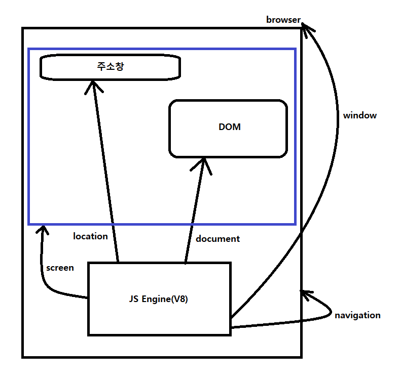

# ch06

  
**ex01.html, popup.html** - BOM(Browser Object Model) - window객체  
**ex02.html** - BOM(Browser Object Model) - screen객체  
**ex03.html** - BOM(Browser Object Model) - location객체  
**ex04.html** - BOM(Browser Object Model) - navigator객체 확인  
**ex05.html** - DOM(Documnet Object Model) - 용어와 개념  
**ex06.html** - HTMLElement(DOM Node) 만들기01 document.createElement, document.createTextNode, document.body.appendChild  
**ex07.html** - HTMLElement(DOM Node) 만들기02 document.body.innerHTML  
**ex08.html** - HTMLElement 속성 조작하기 node.setAttribute  
**ex09.html** - HTMLElement 가져오기(Select) 4가지 방법  
**ex10.html** - DOM Event 처리방식01  
**ex11.html** - DOM Event 이벤트 등록  
**ex12.html** - DOM Event 기본동작 막기 event.preventDefault  
**ex13.html** - DOM Event 기본동작 막기  
**ex14.html** - Event Propagation(Bubbling)  