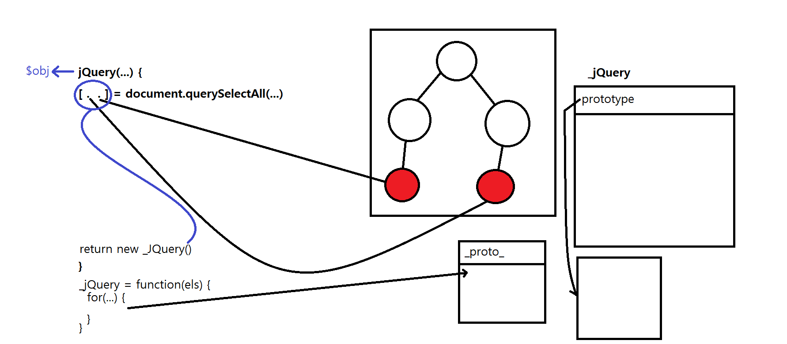

# ch07  

-
**ex01.html** - jQuery 내부 동작 개념  
**ex02.html** - DOM로딩 완료 시점  
**ex03.html** - 간단 jQuery 만들어 보기  
**ex04.html** - jQuery 객체  
**ex05.html** - 선택자 - 태그 - $('li').css('color', '#f00')  
**ex06.html** - 선택자 - id - $('#first').css('color', '#f00')  
**ex07.html** - 선택자 - 클래스 - $('#first').css('color', '#f00')  
**ex08.html** - 선택자 - 하위 - $('.red strong').css('color', '#f00')  
**ex09.html** - 선택자 - 전체 - $('li *').css('color', 'red')  
**ex10.html** - 선택자 - 다중 - $('#second, #fourth').css({fontSize: '2.0em', fontWeight: 'bold'})  
**ex11.html** - 선택자 - 자손 - $('li > strong').css('color', 'red')  
**ex12.html** - 선택자 - 인접(형제, sibling) - $('#second + li').css('color', 'red')  
**ex13.html** - 선택자 - 첫번째 자식 - $('ul li:first-child').css('color', 'red')  
**ex14.html** - 선택자 - 속성 - $('li[class="fourth"]').css('color', 'red')  
**ex15.html** - 선택자 - jQuery 필터(first, child) - $('li:first').css('color', 'red')  
**ex16.html** - 선택자 - jQuery 필터(even) - $('li:even').css('backgroundColor', '#00f')  
**ex17.html** - 선택자 - jQuery 필터(contains, has)  
**ex18.html** - API 함수 - text() - $('#p1').text('안녕하세요')  
**ex19.html** - API 함수 - html() - $('#p1').html('`<strong>`안녕하세요`</strong>`')  
**ex20.html** - API 함수 - prepend() - $('#p1').prepend('`<strong>`가나다라마바`</strong>`')   
**ex21.html** - API 함수 - append() - $('#p1').append('`<strong>`사아자차카타파하`</strong>`')  
**ex22.html** - API 함수 - before() - $('#p1').before('`<h1>`타이틀입니다.`</h1>`')  
**ex23.html** - API 함수 - after() - $('#p1').after('`<h1>`내용입니다.`</h1>`')  
**ex24.html** - API 함수 - prependTo() - $('p strong').prependTo('#p1')  
**ex25.html** - API 함수 - appendTo() - $('p strong').appendTo('#p1')  
**ex26.html** - API 함수 - insertBefore()  
**ex27.html** - API 함수 - insertAfter()  
**ex28.html** - API 함수 - wrap()  
**ex29.html** - API 함수 - wrapAll()  
**ex30.html** - API 함수 - replaceWith()  
**ex31.html** - API 함수 - remove()  
**ex32.html** - API 함수 - attr()  
**ex33.html** - API 함수 - addClass()/removeClass()  
